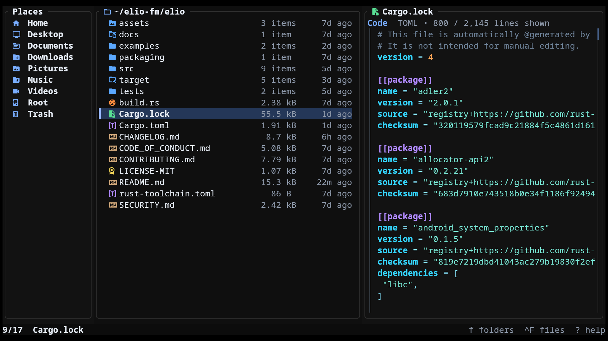
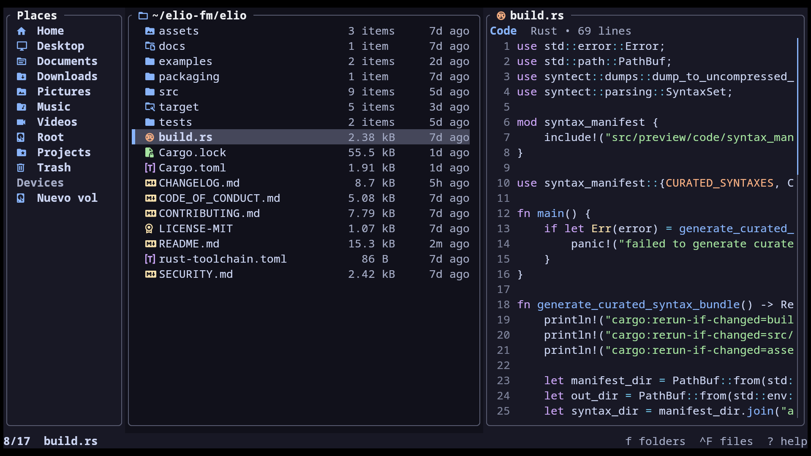
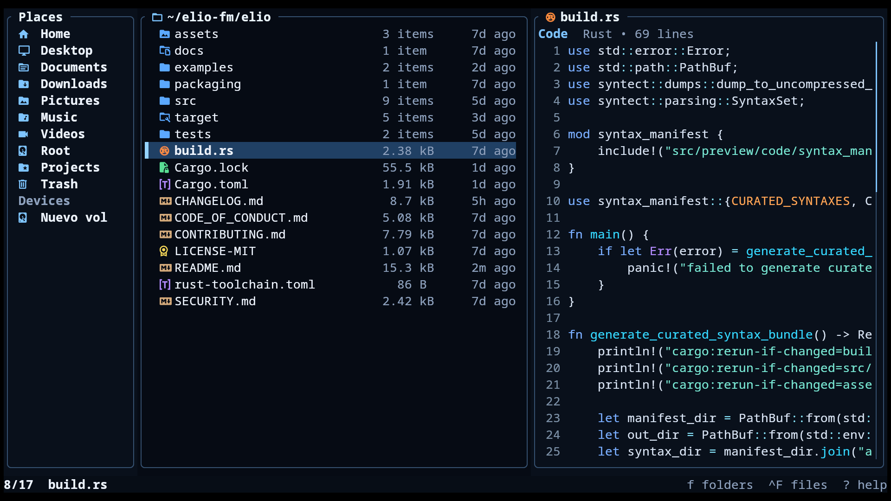
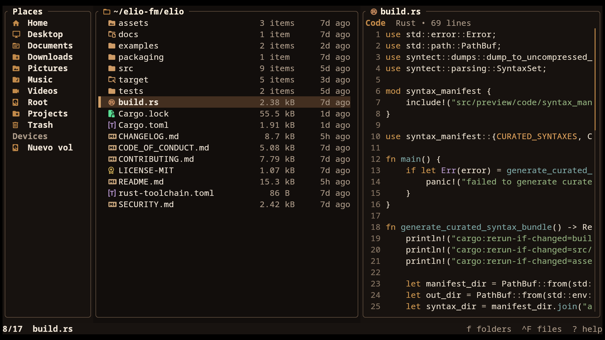
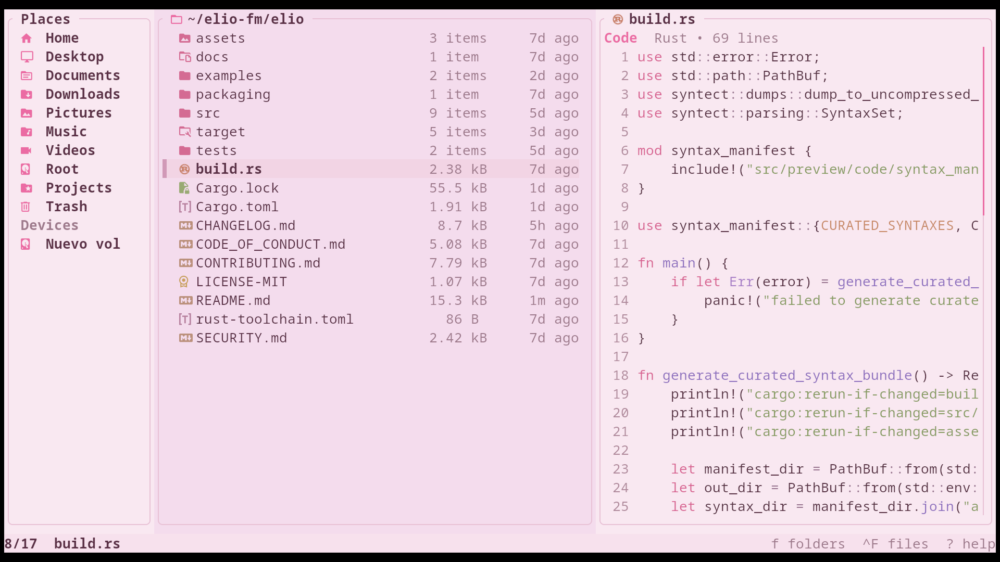

<h1 align="left">&nbsp;elio</h1>

Snappy, batteries-included terminal file manager with rich previews, inline images, bulk actions, and trash support.



---

## Features

- **Three-pane layout** — Places, Files, and Preview side by side
- **Rich previews** — text, code, documents, archives, media, and more; see [Preview Coverage](#preview-coverage)
- **Inline images** — rendered directly in supported terminals
- **Customizable Places and devices** — pinned folders plus auto-detected drives and mounts
- **Quick actions** — Go-to, Open With, and copy-to-clipboard
- **Trash management** — trash, restore, or permanently delete files
- **Keyboard and mouse navigation** — browse comfortably either way
- **Grid and list views** — switch with `v`, zoom the grid with `+` / `-`
- **Fuzzy search** — find folders and files quickly
- **Zoxide jumps** — jump to frequent directories from your zoxide history
- **Theming** — full palette and file-class control via `theme.toml`

---

## Installation

### Arch Linux

Install from the AUR with your preferred AUR helper:

```bash
paru -S elio
```

### Fedora

Enable the COPR repository and install with `dnf`:

```bash
sudo dnf copr enable miguelregueiro/elio
sudo dnf install elio
```

### Debian and Ubuntu-based Linux

Configure the official apt repository and install with `apt`:

```bash
curl -fsSL https://elio-fm.github.io/elio-apt/install.sh | sudo sh
sudo apt install elio
```

Manual repository setup is available in [`elio-apt`](https://github.com/elio-fm/elio-apt). To install without adding a repository, download `elio_amd64.deb` from the [latest release](https://github.com/elio-fm/elio/releases/latest).

The apt repository currently publishes `amd64` packages.

### Homebrew

Install from the Homebrew tap:

```bash
brew install elio-fm/elio/elio
```

### Cargo

Install from crates.io:

```bash
cargo install elio
```

`elio` starts in your current working directory by default. Pass a directory path to start there instead, for example `elio path/to/directory`.

> [!TIP]
> Recommended: use a Nerd Font in your terminal so icons display correctly.

<details>
<summary><strong>Running From Source</strong></summary>

```bash
cargo run --release
```

</details>

---

## Example Themes

A few bundled themes are shown below. More are available in [`examples/themes/`](examples/themes/) — copy any `theme.toml` to your platform's theme path to apply it. See [Theming](#theming) for the paths and override rules.

| Catppuccin Mocha | Navi |
|---|---|
| <p align="center"></p> | <p align="center"></p> |

| Amber Dusk | Blush Light |
|---|---|
| <p align="center"></p> | <p align="center"></p> |

---

## Image Previews

Inline visual previews, including images, covers, thumbnails, and rendered pages, work automatically on supported terminals.

| Terminal | Protocol | Status |
|---|---|---|
| [Kitty](https://sw.kovidgoyal.net/kitty/) | Kitty Graphics Protocol | ✓ Auto-detected |
| [Ghostty](https://ghostty.org/) | Kitty Graphics Protocol | ✓ Auto-detected |
| [Warp](https://www.warp.dev/) | Kitty direct-placement protocol | ✓ Auto-detected |
| [WezTerm](https://wezfurlong.org/wezterm/) | iTerm2 Inline Protocol | ✓ Auto-detected |
| [iTerm2](https://iterm2.com/) | iTerm2 Inline Protocol | ✓ Auto-detected |
| [Konsole](https://konsole.kde.org/) | Kitty direct-placement protocol | ✓ Auto-detected |
| [foot](https://codeberg.org/dnkl/foot) | Sixel | ✓ Auto-detected |
| [Windows Terminal](https://github.com/microsoft/terminal) | Sixel | ✓ Auto-detected |
| Alacritty | — | Not supported |
| Other | Kitty Graphics Protocol | Set `ELIO_IMAGE_PREVIEWS=1` to enable |

> Sixel terminals can render large or first-time previews more slowly than Kitty Graphics or iTerm2 Inline backends.
>
> In Konsole, inline previews are temporarily cleared while modal popups are open to avoid rendering artifacts.

Useful environment variables:

<details>
<summary><strong>Environment Variables</strong></summary>

| Variable | Effect |
|---|---|
| `ELIO_IMAGE_PREVIEWS=1` | Force-enable on unrecognized terminals that support the Kitty Graphics Protocol |
| `ELIO_ZOXIDE_OPTS` | Extra options appended to the zoxide interactive picker options |
| `ELIO_DEBUG_PREVIEW` | Log image preview activity to `elio-preview.log` in the system temp directory |
| `ELIO_LOG_MOUSE` | Log raw mouse events to `elio-mouse.log` in the system temp directory |

</details>

---

## Optional Preview Tools

`elio` works out of the box with no extra setup. Installing a few common utilities enables richer previews, metadata, thumbnails, and broader file format support. Only install what you need.

Inline image previews also require a compatible terminal. See [Image Previews](#image-previews).

### What to Install

| Category | Package / Tool | Commands | Enables |
|---|---|---|---|
| PDF | Poppler | `pdfinfo`, `pdftocairo` | PDF metadata and rendered page previews |
| Media | FFmpeg | `ffprobe`, `ffmpeg` | Audio/video metadata, album art, video thumbnails, and wider image format support |
| Images | resvg | `resvg` | SVG inline previews |
| Archives | 7-Zip | `7z` | Comic book archive previews, fallback archive listings, and additional archive formats |

### Install Examples

| Platform | Install |
|---|---|
| Linux | Install packages that provide `pdfinfo`, `pdftocairo`, `ffprobe`, `ffmpeg`, `resvg`, and `7z`. Package names vary by distro. |
| macOS / Homebrew | `brew install poppler ffmpeg resvg sevenzip` |
| FreeBSD | `pkg install poppler-utils ffmpeg resvg 7-zip` |
| Windows / Scoop | `scoop install poppler ffmpeg resvg 7zip` |
| Windows / WinGet | Install Poppler, FFmpeg, and 7-Zip with WinGet. Install `resvg` separately if needed. |

<details>
<summary><strong>Optional Fallback Tools</strong></summary>

Most users do **not** need these, but they can help in edge cases:

| Tool | Command | Used for |
|---|---|---|
| ImageMagick | `magick` | SVG fallback when `resvg` is unavailable |
| libarchive | `bsdtar` | Rare archive formats and ISO fallback |
| cdrtools / cdrkit | `isoinfo` | Additional ISO listing fallback |
| unrar | `unrar` | RAR/CBR fallback if `7z` lacks RAR support |

</details>

---

## Using elio over SSH

`elio` works well over SSH for navigation, file operations, text and code previews, and terminal-based workflows. Rich visual previews and open actions depend on the local terminal and the remote host.

- Text and code previews work well, including plain text, source code, Markdown, logs, JSON, YAML, TOML, and HTML previewed as source code.
- Rich visual previews such as images, rendered PDF pages, video thumbnails, album art, SVG previews, and archive extras depend on terminal image protocol support and optional preview tools on the remote machine.
- Terminal apps chosen through `Open With`, including default terminal app matches, run inside the current SSH session.
- `Enter`, `o`, fallback system openers, and GUI-style `Open With` entries use the remote host's opener stack, so they may open there, fail, or do nothing useful from an SSH session.

See [Image Previews](#image-previews) and [Optional Preview Tools](#optional-preview-tools).

---

## Workflow

### Opening Files

`Enter` enters folders and opens files with the system default application; when items are selected, it opens the selected items instead. `o` always opens the focused item or selected items externally using the system launcher: `open` on macOS, `cmd /c start` on Windows, and `gio` (with `xdg-open` as fallback) on Linux and BSD desktop sessions.

`O` is for files. On macOS and Linux/BSD desktop sessions, elio discovers matching applications, opens the file directly when there is one match, and shows the Open With chooser when there are multiple. Terminal apps such as `nvim` are supported too. When no match is found, or on platforms without app discovery, elio falls back to the default opener.

### Clipboard

`c` copies selected file names, paths, or directory paths using OSC52 on supported terminals, or falls back to platform clipboard tools:

- Wayland: `wl-copy`
- X11: `xclip` or `xsel`
- macOS: `pbcopy`
- Windows: `clip`

### Go-to Menu

`g` opens a quick jump menu with shortcuts for the top of the current folder, Downloads, Home, the platform config folder, and Trash. The config destination is `~/.config` or `$XDG_CONFIG_HOME` on Linux and BSD, `~/Library/Application Support` on macOS, and `%APPDATA%` on Windows.

### Trash

`d` moves the selected item or selection to the operating system trash. In the Trash view, `d` permanently deletes items and `r` restores them.

Trash uses the platform's native behavior where possible: Linux tries `gio trash` first, then falls back to the Freedesktop Trash layout; BSD uses Freedesktop Trash; macOS moves items to `~/.Trash` and records restore metadata for items trashed by elio.

Windows can move items to the Recycle Bin through the platform trash backend, but elio does not expose the Recycle Bin as a browsable Trash view yet, so restore/permanent-delete-from-Trash workflows are not supported there.

On Freedesktop Trash systems, the stored filename may be changed to avoid collisions, for example `photo.jpg.2`. elio reads the matching `.trashinfo` metadata, so the file is still shown, previewed, opened, and restored as the original `photo.jpg`.

### Fuzzy Search

`f` searches folders and `Ctrl+F` searches files in the current directory tree. Search follows the hidden-file setting, includes symlinks as leaf entries (linked directories appear in folder search, linked files and broken symlinks in file search) but does not descend into linked directories, prunes common generated folders such as `.git`, `node_modules`, and `target`, streams results while scanning, and refreshes when the directory changes. Very large trees are capped so search stays responsive; when the cap is reached, the overlay shows `scan limit reached`.

### Zoxide

`z` opens `zoxide query -i` for jumping to directories from your zoxide history. It requires `zoxide` to be installed and available in `PATH`, and it shows results only after zoxide has recorded directory history. The current directory is excluded from the picker. Extra picker options can be appended with `ELIO_ZOXIDE_OPTS`.

---

## Preview Coverage

`elio` can preview a broad range of content in the Preview pane, including text, structured data, document details, archive contents, and media metadata with covers or thumbnails when available.

- **Text and code** — plain text, source code with syntax highlighting, and Markdown
- **Structured data** — JSON, JSONC, JSON5, YAML, TOML, `.env`, logs, CSV/TSV, and SQLite
- **Documents** — PDF, EPUB, MOBI, AZW3, DOC, DOCX, DOCM, ODT, Pages, XLSX, XLSM, ODS, PPTX, PPTM, and ODP
- **Media** — image metadata and inline previews, audio metadata and covers, and video metadata and thumbnails
- **Folders and archives** — directories, ZIP/TAR/RAR/7z archives, CBZ/CBR comic archives, torrents, ISO images, and other disk-image-style containers
- **Binary files** — metadata previews for non-text files

See [Optional Preview Tools](#optional-preview-tools) for helpers that unlock richer metadata, thumbnails, and rendered previews.

---

## Configuration

| Platform | Config file |
|---|---|
| Linux / BSD | `~/.config/elio/config.toml` (or `$XDG_CONFIG_HOME/elio/config.toml`) |
| macOS | `~/Library/Application Support/elio/config.toml` |
| Windows | `%APPDATA%\elio\config.toml` |

See [examples/config.toml](examples/config.toml) for a complete annotated example.

Supported sections:

- `[ui]`: startup UI options like top bar, hidden files, and initial grid view
- `[places]`: pinned sidebar entries and the `Devices` section
- `[layout.panes]`: relative pane weights for Places, Files, and Preview
- `[keys]`: single-character key rebinding for browser actions

Notes:

- Omit `[places]` to keep the default sidebar.
- Omit `[layout.panes]` to use the built-in responsive layout.
- If `[layout.panes]` is set, all three pane weights must be provided.
- `places = 0` hides the Places pane, and `preview = 0` hides the Preview pane.
- `files` must be greater than `0`.
- Pane weights are relative, so `10/45/45` and `20/90/90` produce the same split.
- In narrow terminals where Preview stacks below Files, `files` and `preview` control the vertical split.
- `places.entries` accepts built-in names, `{ builtin, icon? }`, or `{ title, path, icon? }`.
- Custom `places` paths must be absolute or start with `~/`.
- Invalid `places` entries are skipped with a warning.
- Invalid or conflicting key bindings fall back to defaults with a warning.
- Invalid TOML falls back to the built-in defaults.

---

## Theming

| Platform | Theme file |
|---|---|
| Linux / BSD | `~/.config/elio/theme.toml` (or `$XDG_CONFIG_HOME/elio/theme.toml`) |
| macOS | `~/Library/Application Support/elio/theme.toml` |
| Windows | `%APPDATA%\elio\theme.toml` |

Theme files layer on top of the built-in defaults, so you only need to set the keys you want to change.

Supported sections:

- `[palette]`: app-wide colors
- `[preview.code]`: syntax highlight colors for code previews
- `[classes.<name>]`: default icon and color for a file class
- `[extensions.<ext>]`: overrides by file extension
- `[files."<name>"]`: overrides by exact filename
- `[directories."<name>"]`: overrides by exact directory name

Rules:

- `symlink_directory` and `broken_symlink` win over exact-name and extension rules.
- Exact filename or directory rules win over extension rules.
- Extension rules win over class defaults.
- Symlinked files keep their normal file-type appearance.
- Matching is case-insensitive.
- Invalid theme files fall back to the built-in defaults, with errors reported to stderr.

**Built-in file classes:** `directory` · `symlink_directory` · `broken_symlink` · `code` · `config` · `document` · `license` · `image` · `audio` · `video` · `archive` · `font` · `data` · `file`

Any color value also accepts `"none"` (alias: `"transparent"`) to reset that foreground or background to the terminal default. For background fields, this lets transparent terminals show through. See [`examples/themes/transparent/theme.toml`](examples/themes/transparent/theme.toml).

See [`assets/themes/default/theme.toml`](assets/themes/default/theme.toml) for the full default theme.

---

<details>
<summary><strong>Controls</strong></summary>

Keys marked with `*` are configurable in `[keys]` in `config.toml`; the defaults are shown here.

### Navigation

| Key | Action |
|---|---|
| `↑` / `↓` · `j` / `k` | Move selection |
| `←` · `h` · `Backspace` | Go to parent directory |
| `→` · `l` | Enter folder |
| `Enter` | Enter folder / open file or selection |
| `g` | Go-to menu (`g` top, `d` downloads, `h` home, `c` config folder, `t` trash) |
| `G` | Jump to last item |
| `PageUp` / `PageDown` | Page up / down |
| `Tab` / `Shift+Tab` | Cycle places |
| `Alt+←` / `Alt+→` | Back / forward in history |

### Search

| Key | Action |
|---|---|
| `f` `*` | Fuzzy-find folders in the current tree |
| `Ctrl+F` | Fuzzy-find files in the current tree |
| `z` `*` | Jump with zoxide directory history |

### File Actions

| Key | Action |
|---|---|
| `o` `*` | Open focused item or selection with the system default application |
| `O` `*` | Open With chooser |
| `a` `*` | Create file or folder |
| `d` `*` | Trash; permanently delete if already in trash |
| `r` `*` | Rename / bulk rename / restore from trash |
| `F2` | Rename / bulk rename |

### View

| Key | Action |
|---|---|
| `v` `*` | Toggle grid / list view |
| `+` / `-` | Grid zoom in / out |
| `.` `*` | Show / hide dotfiles |
| `s` `*` | Cycle sort (Name → Modified → Size) |

### Preview

| Key | Action |
|---|---|
| `Shift+K` / `Shift+J` `*` | Step page (PDF, comic, EPUB) or scroll preview up / down |
| `Shift+H` / `Shift+L` `*` | Scroll preview left / right |
| `[` / `]` | Step page (PDF, comic, EPUB) or scroll text/code |

### Selection and Clipboard

| Key | Action |
|---|---|
| `Space` | Toggle selection |
| `Ctrl+A` | Select all |
| `y` `*` | Yank (copy) |
| `x` `*` | Cut |
| `p` `*` | Paste |
| `c` `*` | Copy path details to clipboard |

### Mouse

| Action | Description |
|---|---|
| Click | Select item |
| Double-click | Open item |
| Scroll | Scroll browser or preview |
| `Shift+Scroll` | Scroll preview sideways |

### General

| Key | Action |
|---|---|
| `?` | Open help overlay |
| `Esc` | Cancel / clear selection / close overlay |
| `q` `*` | Quit |

</details>

---

## License

[MIT](LICENSE-MIT)
